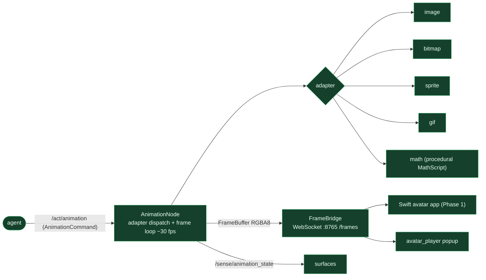

# 2D avatar — agent → animation node → frames → renderer

**Status: ✅ built end-to-end** — animation node + 5 adapters, WebSocket FrameBridge, Swift app (Phase 1) + Python popup.

**Flow.** The agent fires `/act/animation` (via the `set_avatar_state` tool → emotion/clip) → **AnimationNode** routes to one of five adapters and runs a frame loop paced by the adapter (~30 fps) → each `FrameBuffer` (RGBA8) goes to the **FrameBridge** WebSocket server → broadcast to the Swift app and/or the `avatar_player` popup. State changes publish on `/sense/animation_state`. `AvatarAutoStateDriver` flips the face to "speaking" on TTS start.

**Adapters (skill-tree L1→L4):** `image` (static raster) · `bitmap` (1-bit packed) · `sprite` (sheet crop) · `gif` (animated, per-frame durations) · `math` (procedural Python `MathScript`, e.g. the Lilith face).

**Key files:** `nodes/animation/node.py` · `nodes/animation/adapters/*` · `nodes/animation/bridge.py` (`FrameBridge`) · `nodes/animation/auto_state.py` · `interfaces/avatar/` (Swift) · `interfaces/avatar_player/`. The Swift renderer is a Phase-1 scaffold (connects, decodes, displays); richer Metal rendering is Phase 2.

> Note: this is the **live** `nodes/animation` node. Mochi's further-developed engine + its MScript language live separately in `nodes/animation_dev/` (parallel dev node, not wired live).
