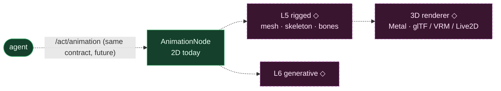

# 3D avatar — ◇ planned (not built)

**Status: ◇ planned** — no 3D implementation exists in the codebase today.

**Reality check (code-verified).** There is **no** 3D today — no mesh/rig loading (glTF, GLB, VRM, Live2D), no 3D renderer, no skeleton/bone animation. Every current renderer (Swift app, Python popup) is 2D raster. 3D sits in the skill-tree roadmap as **L5 (rigged)** and **L6 (generative)**, unlocked only after the L4 procedural tier — architectural placeholders, zero implementation.

**To build:** a rig/mesh format choice + loader, a GPU renderer (the Swift app's Phase-2 Metal view is the natural home), and a bone/blendshape animation layer driven by the **same** `/act/animation` + `/sense/tts_chunk` contracts the 2D path already uses — so the brain side doesn't change.
