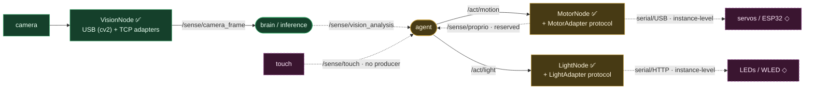

# Hardware integration — motor · light · vision

**Status: 🟡 mixed** — vision is built (USB + TCP cameras); motor + light are skeletons (node + adapter protocol, no real device I/O in the library).

**Library + instance split.** The library ships universal **nodes + adapter protocols + reference serial adapters**; real device I/O is wired per robot at deploy time (subclass the adapter). So:

- **Vision — ✅ built / operational.** `USBCameraAdapter` (OpenCV `cv2.VideoCapture`) + `TCPCameraAdapter` (length-prefixed socket) are both real, latest-frame-wins, and publish `/sense/camera_frame`.
- **Motor — 🟡 skeleton.** `MotorNode` subscribes `/act/motion` and forwards to a `MotorAdapter`; `SerialMotorAdapter` formats `VEL …` / `WP …` ASCII but has **no real serial/TCP** in the library. `/sense/proprio` is reserved, not yet produced.
- **Light — 🟡 skeleton.** `LightNode` + `SerialLightAdapter` format `LED …` ASCII; **no real NeoPixel/WLED** in the library.
- **Touch — ◇** topic defined, no producer node.

**Key files:** `nodes/{motor,light,vision}/node.py` + `nodes/{motor,light,vision}/adapters.py`. **To build:** concrete device adapters per target board (the JP01 boards).
