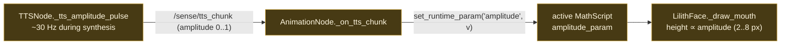

# Lip-sync — TTS amplitude → mouth

**Status: 🟡 working, but a sin-wave proxy** — real RMS from Kokoro is deferred to 0.5.x.

**Flow.** While Kokoro synthesizes, `TTSNode` runs a thread that publishes `/sense/tts_chunk` amplitude (~30 Hz) → `AnimationNode` forwards it to the active adapter via `set_runtime_param("amplitude", v)` → the `MathScript` reads it each frame → `LilithFace._draw_mouth` scales the mouth (closed at 0.0 → ~8 px open at 1.0).

**The honest caveat (code-verified).** The amplitude is a **sin-wave proxy** (≈5 Hz syllable-like: `(sin(2π·5·t)+1)/2` + jitter, floor 0.15) — **not** real audio analysis. It reads as convincingly synced but doesn't track actual phonemes. Real RMS sampling waits on a Kokoro streaming-audio callback (0.5.x).

**Key files:** `nodes/tts/node.py:_tts_amplitude_pulse` · `nodes/animation/node.py:_on_tts_chunk` · `nodes/animation/adapters/math_adapter.py` · the face `MathScript`. The data path is fully wired; only the amplitude **source** is a placeholder.
