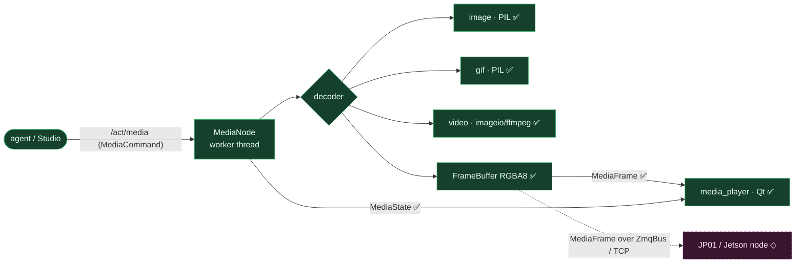

# Media — media node → frames → player

**Status: ✅ built** — the node's bus contract (`ACT_MEDIA` / `MediaFrame` / `MediaState`) is declared + registered; the node decodes a file → RGBA `MediaFrame`s and streams them (verified via `dev/pipelines/media.py`).

**Flow.** The agent / Studio publishes `/act/media` (a `MediaCommand`) → `MediaNode` decodes the asset (image / gif / video) on a worker thread → emits RGBA `MediaFrame`s. Locally the `media_player` Qt window subscribes and `feed_frame`s them; cross-machine the **same** `MediaFrame` rides the `ZmqBus` over TCP to a device node (JP01 / Jetson) — the upstream-render-on-Mac / downstream-display split.

**Was a gap, now fixed.** The node referenced `topics.ACT_MEDIA` / `MediaFrame` / `MediaState` which weren't declared in `transport/topics.py` — so it `AttributeError`'d on boot. The three topics are now defined + registered (registration makes them encode for the ZMQ path). Verified: `dev/pipelines/media.py` boots the node and streams a 480×360 RGBA frame.

**Next (0.6/0.7):** a publisher of `MediaCommand` to drive it from the UI (the Studio Media tab plays files directly today), and the JP01 streaming adapter that consumes `MediaFrame` over the `ZmqBus` on the device.

**Key files:** `nodes/media/node.py` · `nodes/media/decoders/*` · `nodes/media/frames.py` · `interfaces/media_player/window.py` · `transport/topics.py` (the three topics).
