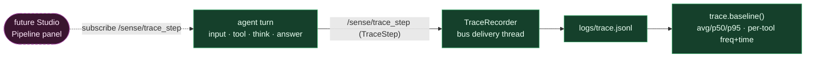

# Observability — pipeline trace → baseline

**Status: ✅ built** (this session).

**Flow.** Every turn emits one `TraceStep` per phase (`input → tool… → think → answer`) on `/sense/trace_step` **as it runs** — a queue `put_nowait`, so zero hot-path cost. A `TraceRecorder` (on the bus delivery thread, off the turn) appends each to `logs/trace.jsonl`. `python -m jaeger_os.agent.trace` prints the baseline (turn count, avg/p50/p95 total time, per-tool frequency + time); `--last` replays a turn's timeline. A future Studio "Pipeline" panel subscribes to the same topic for a live view.

**Key files:** `agent/trace.py` · `transport/topics.py` (`TraceStep`, `SENSE_TRACE_STEP`) · `main.py` (emit seams + recorder wiring). Rides on the existing per-tool `elapsed_s` + `LatencyReport` — no new timing code.
