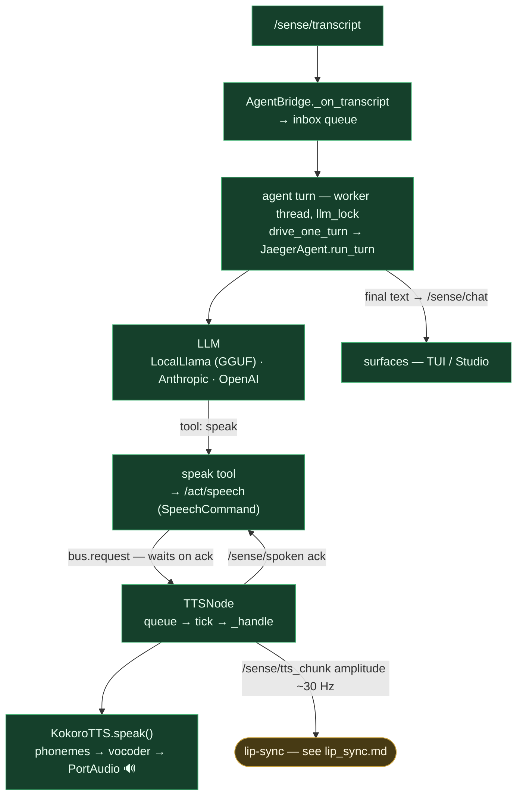

# STT → LLM → TTS — the conversation loop

**Status: ✅ built** end-to-end — Kokoro TTS; local llama.cpp or external Anthropic/OpenAI.

**Flow.** `/sense/transcript` → `AgentBridge` queues it → a worker thread runs the turn (serialized by `llm_lock`) → the LLM decides and may call the **speak** tool → `speak` publishes `/act/speech` and blocks on a `/sense/spoken` ack (correlation-id matched) → `TTSNode` synthesizes via **Kokoro** (PortAudio playback) and emits `/sense/tts_chunk` amplitude for lip-sync → the final answer goes out on `/sense/chat`.

**LLM:** local `llama-cpp-python` (GGUF, default) or external (Anthropic/OpenAI) with fallback to local. **TTS:** Kokoro v0.19; voice resolved from the active character's `voice_id`.

**Key files:** `agent/loop/bridge.py` · `main.py:_run_turn_via_jaeger_agent` · `agent/loop/jaeger_agent.py` · `agent/tools/speak.py` · `nodes/kokoro_tts/node.py` · `nodes/kokoro_tts/engine.py`. Full path is real — the `/sense/tts_chunk` amplitude is a sin-wave proxy (see `lip_sync.md`).
