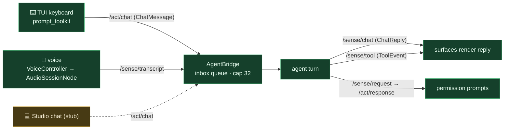

# User input — how input reaches the brain

**Status: ✅ built** for keyboard + voice; 🟡 the Studio/PySide6 chat surface is contract-only (stub).

**Flow.** Three entry surfaces converge on **AgentBridge**: the TUI keyboard publishes `ChatMessage` on `/act/chat`; voice arrives as `Transcript` on `/sense/transcript`; the (stubbed) Studio chat would also use `/act/chat`. The bridge queues input, runs one turn per item, and fans results back — `ChatReply` on `/sense/chat`, tool activity on `/sense/tool`, and tier-gated permission prompts on `/sense/request` (answered via `/act/response`).

**Key files:** `interfaces/tui/app.py` + `interfaces/tui/voice_session.py` · `agent/loop/bridge.py` · `core/messages.py` · `agent/loop/bus_confirm.py`. Keyboard + voice + bridge are fully built; the PySide6 Studio chat surface is a contract-only stub.
