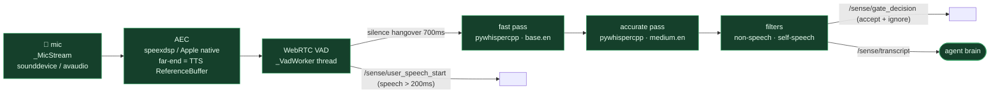

# Voice in · ASR — mic → transcript

**Status: ✅ built** — `pywhispercpp` (whisper.cpp) two-pass STT, WebRTC VAD, optional AEC for barge-in. No stubs.

**Flow.** Mic frames (16 kHz / 30 ms) → optional **AEC** (lets the agent be interrupted while it's speaking) → **WebRTC VAD** detects speech and emits `/sense/user_speech_start` after ~200 ms → on a 700 ms silence hangover a **fast** model (`base.en`) gives a quick transcription, then an **accurate** model (`medium.en`) produces the final text → deterministic filters drop `[BLANK_AUDIO]` and self-speech → `/sense/transcript` to the brain. Every accept/ignore decision is mirrored on `/sense/gate_decision`.

**STT engine:** `pywhispercpp` (whisper.cpp). **Modes:** `two_pass` (default — `base.en` fast → `medium.en` accurate, two models) or `continuous` (single `base.en`, energy segmentation). **Config:** `AudioSessionConfig` — `stt_mode`, `fast/accurate_model_name`, `require_wake_word`, `barge_in`, `self_speech_threshold`.

**Key files:** `nodes/audio_session/node.py` (`AudioSessionNode`) · `core/audio/session.py` (`AudioSession`) · `plugins/whisper_stt/{two_pass,continuous}.py` · `core/audio/aec.py`. The semantic LLM gate moved into the brain prompt (2026-06-07); deterministic filters remain node-side.
